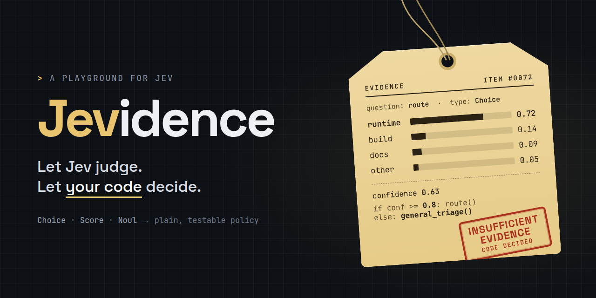

# Jevidence

**A playground for Jev. Let Jev judge. Let your code decide.**

Turn TypeSafe AI's **Choice**, **Noul**, and **Score** judgments into an ordinary,
testable routing policy. The model proposes evidence; your code decides whether
that evidence is enough to suggest a queue. Nothing in this project assigns
issues, runs commands, or writes to an external system.

A companion to [Jev for developers: typed decisions inside real software](https://peakevergreen.com/blog/jev-for-developers/)
by [Peak Evergreen](https://peakevergreen.com/). This is an independent educational
project, not an official TypeSafe product.

## Start in 30 seconds

Requires Python **3.10+**. No packages, API key, or network are needed for the
fixture demo. These commands work from a fresh clone:

```sh
git clone https://github.com/peakevergreen/jevidence.git
cd jevidence
python3 -m jevidence demo
python3 -m jevidence evaluate
python3 -m unittest discover -s tests -v
```

Or use `make demo`, `make evaluate`, and `make test`.

The default synthetic case says **runtime, confidence 0.72**. The policy needs
**0.8**, so it proposes **general-triage**. Try a stronger judgment or change the
threshold:

```sh
python3 -m jevidence demo --case runtime-ready
python3 -m jevidence demo --route-floor 0.7
python3 -m jevidence evaluate --route-floor 0.95
```

Output is JSON and includes `mode`, `evidence`, `proposed_queue`, `reason`,
`current_queue`, question/policy versions, thresholds, and `applied: false`.

**All bundled judgments are constructed fixtures, not captured Jev responses.**
Eight matching cases show that the policy behaves as specified; they do not
measure model accuracy, calibration, or production readiness. Changing a threshold
can deliberately change agreement with the fixture expectations.

## The boundary worth keeping

```text
Validated issue → Jev judgment → normalized evidence → Python policy → suggestion
                         failure → retain current queue; no invented judgment
```

| Primitive | Question in this sandbox | What code does with it |
| --- | --- | --- |
| Choice | Which area should investigate: docs, build, runtime, or other? | Uses an allowlist and a confidence threshold. |
| Noul | Are explicit reproduction steps present? | Sends runtime reports with weak reproduction evidence to review. |
| Score | How specific is the observation on a 0–2 rubric? | Records the result for inspection; does not turn it into severity or priority. |

The central policy is in [`jevidence/policy.py`](jevidence/policy.py):

```python
if evidence.choice not in QUEUES:
    return Decision("general-triage", "unknown_or_fallback_category")
if evidence.confidence < thresholds.route_floor:
    return Decision("general-triage", "route_confidence_below_floor")
if evidence.choice == "runtime" and evidence.reproduction < thresholds.reproduction_floor:
    return Decision("reproduction-review", "reproduction_below_floor")
return Decision(QUEUES[evidence.choice], "route_passed_policy")
```

The Choice confidence statistic is different from the Noul probability. Neither
threshold is a calibrated recommendation. Keep identifiers, authorization,
numeric checks, persistence, and execution in your application. A category must
never become an unchecked function name, URL, or shell command.

## Make one live request

Live mode sends the issue text to TypeSafe and uses your account's paid API.
The default demo never makes that call, even if an API key is present.

```sh
make setup-live
export TYPESAFE_API_KEY='your-key'
make live
```

Without Make:

```sh
python3 -m venv .venv
.venv/bin/python -m pip install -e .
.venv/bin/python -m pip install -r requirements-live.txt
# Set TYPESAFE_API_KEY in your environment, then:
.venv/bin/python -m jevidence triage --live --input examples/issue.json
```

Windows users can substitute `.venv\Scripts\python.exe` and set the environment
variable in their shell. `.env.example` documents the variable; the program does
not automatically read `.env` files.

The included issue is synthetic. For your own JSON, provide `id`, `title`, and
`body`. Only these three validated fields are sent; extra fields are discarded.
Inspect the text before sending it. Do not put credentials or confidential
customer material into a public issue or fixture.

```sh
.venv/bin/python -m jevidence triage \
  --live --input examples/issue.json \
  --current-queue existing-review \
  --model jev-1.13.0 --timeout 15 \
  --route-floor 0.8 --reproduction-floor 0.85
```

The SDK is pinned to **0.7.1**, and the model defaults to **jev-1.13.0**. Live
output records the resolved model returned by the API. SDK retries are explicitly
disabled to keep this a single-request experiment. The timeout bounds HTTP
operations, not an entire production job. There is no outer retry loop.

On API failure or a missing required answer, the result has `status: unavailable`,
`evidence: null`, and `proposed_queue: null`. The existing queue is retained and
the CLI exits with code **1**. Input/configuration errors exit with **2**. A
completed judgment or fixture evaluation exits with **0**, including a judgment
that correctly falls back to review. Evaluation is exploratory, so mismatches
do not change its exit code; the test suite enforces the expected fixture policy.

Output omits source text and raw provider error messages. Avoid SDK debug logging
for sensitive inputs: SDK request/response logging can include bodies.

## Docker

Requires a running Docker daemon. The image includes the pinned live SDK but
runs the **offline demo** by default, as a non-root user. No key is copied into the
image. The build context uses an allowlist that excludes `.env`, local virtual
environments, and repository metadata.

```sh
make docker-build
make docker-demo    # no network, read-only filesystem
make docker-test    # policy, CLI, and mocked SDK transport tests
```

Equivalent build and run commands:

```sh
docker build --target runtime -t peakevergreen/jevidence:local .
docker run --rm --network none peakevergreen/jevidence:local demo
docker run --rm --network none peakevergreen/jevidence:local evaluate
```

One live request with an already exported key:

```sh
make docker-live
# Or:
docker run --rm -e TYPESAFE_API_KEY peakevergreen/jevidence:local \
  triage --live --input examples/issue.json
```

To use your own issue, mount a specific file read-only and pass its container path.
Never pass a key as a build argument. The Python base tag can receive updates;
this is a repeatable build recipe with pinned application dependencies, not a
claim of byte-identical images.

## Tests and CI

```sh
make test
# Include the real SDK contract tests after setup-live:
.venv/bin/python -m unittest discover -s tests -v
```

The suite covers threshold boundaries, every route, unknown labels, malformed
fixtures, changed thresholds, unavailable judgments, CLI opt-in, and failure
exit behavior. With the live dependencies installed, it exercises the real SDK
through a mocked HTTP transport, checks outgoing questions, disables retries,
and verifies missing-answer and server-error handling. **Tests never call the
live API.** Three SDK tests are skipped when that optional dependency is absent.

GitHub Actions checks Python 3.10, 3.12, and 3.13 and builds/runs both Docker
stages. No repository secrets are required. `requirements-live.txt` pins the
resolved Python 3.12 dependencies; dependencies conditional on older Python
versions may additionally be installed by pip.

## Project map

```text
jevidence/
  policy.py        Pure decision rules and validated evidence
  questions.py     Versioned Choice/Noul/Score definitions
  runner.py        Fixture loading, SDK adapter, failure boundary, evaluation
  cli.py           Offline demo, fixture evaluation, explicit live triage
  data/cases.json  Eight synthetic judgments and expected policy outcomes
examples/issue.json Synthetic issue for a live request
tests/             Policy, CLI, and real-SDK/mocked-HTTP tests
Makefile           Local and Docker commands
Dockerfile         Non-root runtime and test stages
.github/workflows/ci.yml
```

## Extend it into your own experiment

1. Choose one application decision with allowed outcomes and a review queue.
2. Edit the questions and bump `QUESTION_VERSION` when their meaning changes.
3. Change `decide`, bump `POLICY_VERSION`, and add boundary/failure cases.
4. Test real judgments against independently labeled, representative inputs.
   Keep a held-out set separate from the examples used to tune wording or thresholds.
5. Compare wrong routes, review volume, and total handling cost with the existing
   process. Run in shadow mode before introducing any real assignment action.

The same separation can support RAG passage selection, CI failure triage,
handler routing, or document exception queues, as described in the article.
This repository implements **developer-issue triage**; those other adapters are
extension ideas, not features claimed to be included.

Production integrations additionally need an end-to-end deadline, authentication
and authorization, idempotent writes, durable failure handling, observability,
and evaluation on their own data. Prompt wording is not a security boundary.

## References

- [Companion article](https://peakevergreen.com/blog/jev-for-developers/)
- [Official Python SDK](https://docs.typesafe.ai/sdk/python)
- [Client options and retries](https://docs.typesafe.ai/sdk/python/api/clients/sync)
- [Answer types](https://docs.typesafe.ai/sdk/python/api/types/responses)
- [Confidence](https://docs.typesafe.ai/confidence)
- [Model versions and limits](https://docs.typesafe.ai/models)

## Contributing and license

See [CONTRIBUTING.md](CONTRIBUTING.md). Code and documentation are provided under
the [MIT license](LICENSE). The Jevidence artwork is included with this project;
the names and trademarks of TypeSafe and Jev belong to their respective owners.
